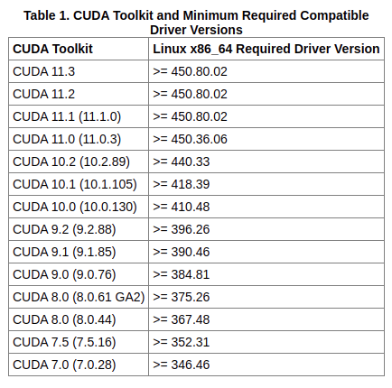

# Install nvidia driver & cuda \(ing\)

## 1. Check Compatibility

Checking graphic driver & cuda version compatibility is a really important step.

&gt;&gt; [https://docs.nvidia.com/deploy/cuda-compatibility/index.html](https://docs.nvidia.com/deploy/cuda-compatibility/index.html)




Also, check graphic card and graphic driver compatibility.

```bash
# check your gpu info
lshw -C display
```

check recommended graphic driver version from here.

&gt;&gt; [https://www.nvidia.com/Download/index.aspx](https://www.nvidia.com/Download/index.aspx)


Choose the compatible nvidia graphic driver version & cuda version that you want to install.

## 2. Install Nvidia Graphic

skip for now

## 3. Install CUDA

Find CUDA download link that matches your environment from the link below.



I downloaded 10.2 version runfile installer. \(since pytorch officially supports 10.2\)

```text
wget https://developer.download.nvidia.com/compute/cuda/10.2/Prod/local_installers/cuda_10.2.89_440.33.01_linux.run
sudo sh cuda_10.2.89_440.33.01_linux.run
```


NOTE

\[X\] ITEM means ITEM is selected and will be installed.



NOTE

cuda 10.2 version has related patches.

Be sure to install all of them


## 4. Set up the development environment

```text
vim ~/.bashrc

# add the following lined
export PATH=/usr/local/cuda-10.2/bin${PATH:+:${PATH}}
export LD_LIBRARY_PATH=/usr/local/cuda-10.2/lib64\
                         ${LD_LIBRARY_PATH:+:${LD_LIBRARY_PATH}}
```

## Ref






